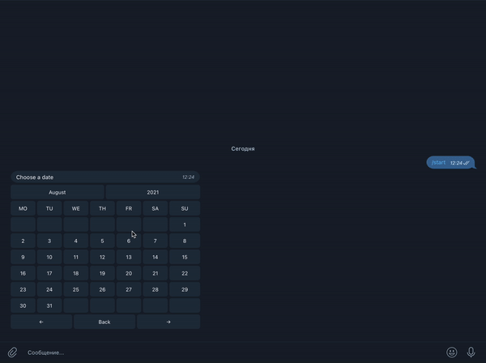

# InlineKeyboardButtons-Calendar for PyTelegramBotApi

**A small library that allows you to give the user a convenient format for selecting the desired date**

## Install

1. `cd /your/project/path`
2. `pip install pytba-calendar`

## Usage

Import the library:

`import pytba_calendar`

**To see examples of usage, please see the project file example.py**

## Timezones

By default, the bot uses the UTC time zone. If you want to change it to another, you should specify your time zone after the declaring calendar object. An example is also available in the file example.py

## Flow

